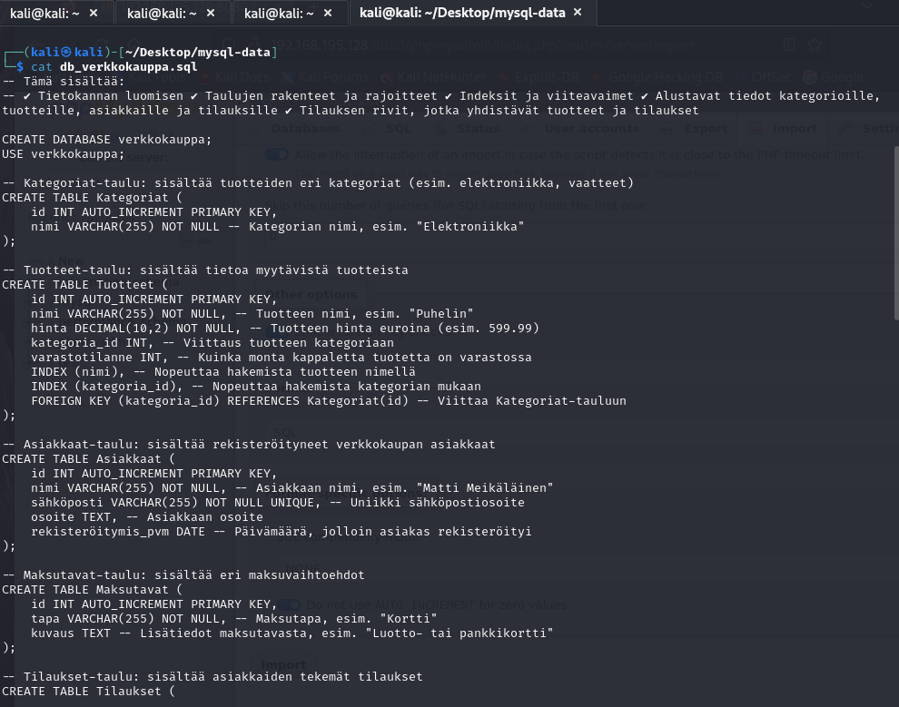
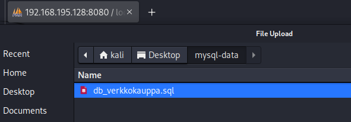
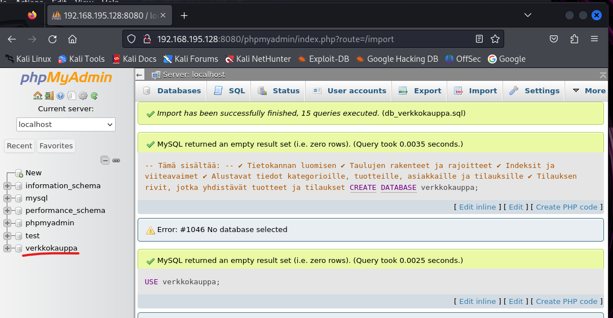
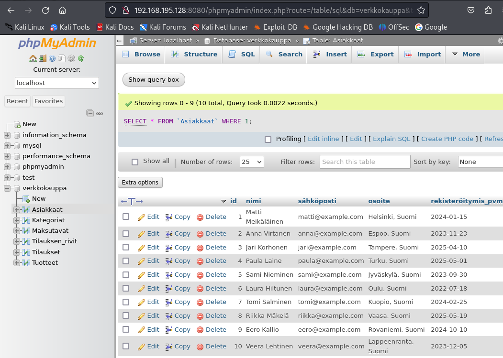

# Toinen backup muoto

Siis ihan normi kali linux luo valmiin tietokannan tiedoston (perus chatgpt) ja hyvä pohja, laiskuus suunnittelua

Tietokanta tiedostossa pitää olla pääte sitten siksi loin `db_verkkokauppa.sql` ja muista tallentaa tehdyt muutokset

Normi upottamisen prosessi ja mistä pollusta

Upotettun jälkeen se kertoo, että onnistui

Ja pikainen tarkistuksen testaus, että ainakin toimi

